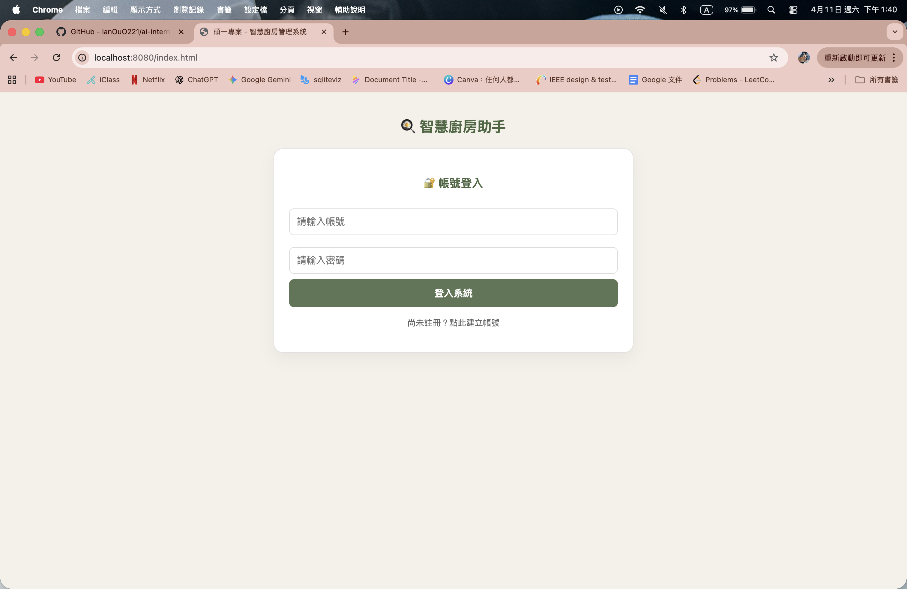
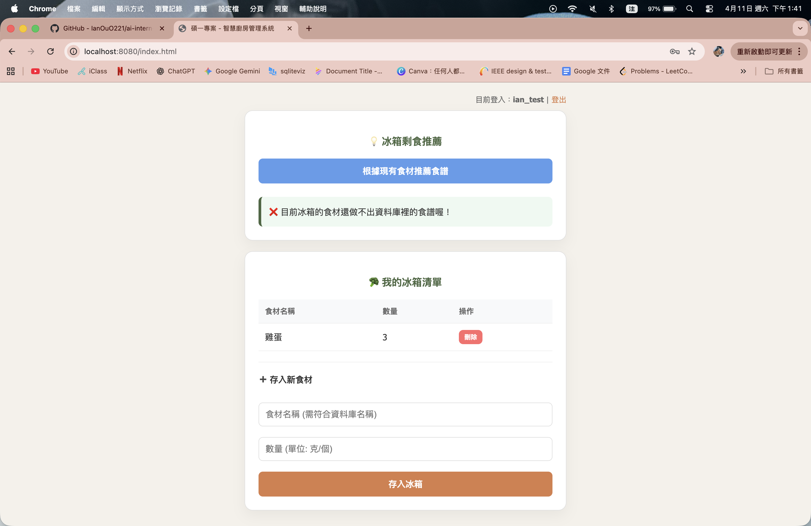

# 🍳 智慧廚房管理系統 (Recipe Matching System)

這是一個基於 **Spring Boot** 與 **PostgreSQL** 開發的全端 Web 應用程式，旨在協助用戶高效管理冰箱食材並提供智慧化的食譜建議。

## 🚀 核心技術亮點：智慧食譜推薦邏輯
本專案最核心的功能在於 **「動態食材比對算法」**。
- **邏輯實現**：後端透過 JPA 從資料庫抓取所有食譜，並即時提取 `ingredients` 欄位字串。
- **比對機制**：系統會自動掃描用戶目前冰箱中的所有食材清單，與資料庫食譜進行交叉比對。
- **精準推薦**：僅當用戶冰箱包含該食譜所需的核心食材時，系統才會動態回傳推薦菜色，解決了「不知道現有食材能煮什麼」的痛點。

## 🛠️ 技術棧
- **Back-end**: Java 25, Spring Boot 4, Spring Data JPA (Hibernate)
- **Front-end**: HTML5, CSS3, JavaScript (Fetch API)
- **Database**: PostgreSQL
- **Security**: 實作了基本的用戶驗證與敏感資訊隱藏機制（如資料庫密碼去識別化）。

## 📝 開發心得
作為碩一資料庫課程的專案，我實作了從資料表設計（ERD）到 RESTful API 開發的全過程。特別是在處理食材比對的 SQL 邏輯時，學習到如何優化查詢效率，並透過前端 Fetch API 實現流暢的異步資料更新。
## 📸 系統功能介面

