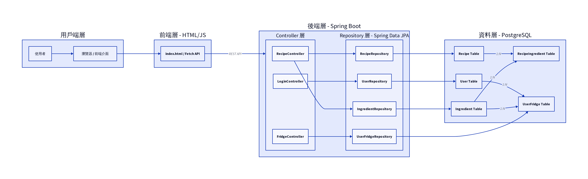
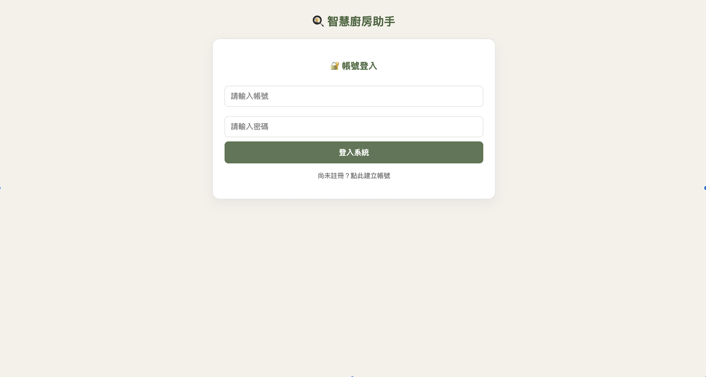
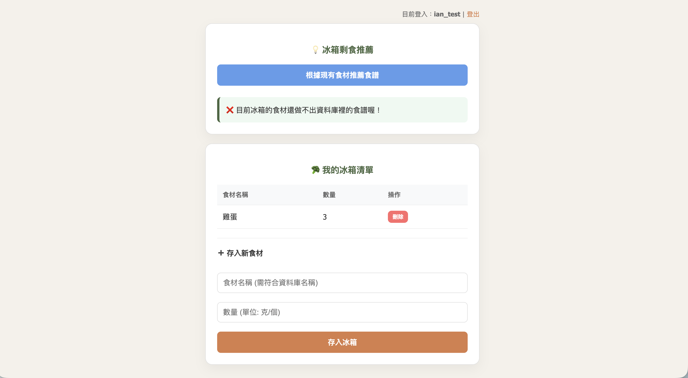

# 🍳 智慧廚房管理系統 (Recipe Matching System)

這是一個從 Python 成功遷移至 **Java Spring Boot** 架構的全端開發專案。本專案不僅是為了練習前後端串接，更結合了真實世界的數據與爬蟲技術，實作一套完整的食材管理與智慧推薦系統。

## 🌟 專案亮點與數據來源
- **權威數據整合**：系統食材基礎資料整合自 **「食藥署 2024 食品營養成分資料庫」**，確保食材命名與營養基礎的準確性。
- **自動化食譜採集**：透過 Python 爬蟲技術，從食譜網站精選並採集了 **30 道核心家常菜色**，建構出本系統的智慧推薦知識庫。
- **技術架構遷移**：本專案記錄了我從 Python 生態系自主學習並跨越至 **Java 生態系** 的過程，實作了更嚴謹的型別檢查與物件導向設計。

## 🏗️ 系統整體架構

### **1. 分層設計說明**
* **用戶端與前端層 (Frontend Layer)**：
    * **技術棧**：HTML5, CSS3, JavaScript (Fetch API)
    * **核心組件**：`index.html` 作為主要進入點，透過 `Fetch API` 與後端 RESTful API 進行非同步通訊，實現無需重新整理頁面的動態交互。
* **後端控制層 (Controller Layer)**：
    * 基於 **Spring Boot** 構建，負責處理 HTTP 請求並協調業務邏輯：
    * **FridgeController**：處理冰箱庫存相關操作（新增、刪除、查詢食材）。
    * **RecipeController**：**核心模組**。實作智慧推薦算法，根據庫存食材交叉比對食譜資料庫。
    * **LoginController**：處理使用者驗證與登入邏輯。
* **資料存取層 (Repository Layer)**：
    * 利用 **Spring Data JPA** 簡化與資料庫的互動，並管理實體狀態：
    * **UserRepository / RecipeRepository**：基礎資料存取。
    * **IngredientRepository**：整合自 **食藥署 (FDA)** 資料庫之食材基礎數據。
    * **UserFridgeRepository**：處理使用者個人冰箱之動態關聯資料。

---

## 🗄️ 資料庫關聯設計

系統資料庫設計包含了關鍵的 **多對多 (Many-to-Many)** 關聯實作，這是支撐推薦算法精準度的地基：

| 資料表 | 說明 | 關鍵欄位 (PK/FK) |
| :--- | :--- | :--- |
| **Recipe** | 儲存食譜基本資訊與步驟 | `RecipeID (PK)`, 菜名, 步驟 |
| **Ingredient** | 儲存食藥署 2024 食品營養數據 | `IngredientID (PK)`, 俗名, 熱量 |
| **RecipeIngredient** | **關鍵中間表**：定義食譜的組成 | `RecipeID (FK)`, `IngredientID (FK)`, 數量 |
| **UserFridge** | 使用者個人冰箱庫存 | `UserID (FK)`, `IngredientID (FK)` |

### **關聯邏輯核心：**
1. **Recipe ↔ Ingredient**：透過 `RecipeIngredient` 中間表建立多對多關係，確保系統能精確分析每道菜所需的每樣食材。
2. **User ↔ Ingredient**：透過 `UserFridge` 實作多對多關係，代表使用者目前的實體庫存，與推薦算法直接連動。

---

## 🚀 核心技術亮點：智慧推薦算法

系統的智慧推薦邏輯基於上述資料關聯實作：
1. **獲取庫存**：從 `UserFridge` 取得當前使用者的食材清單。
2. **組成比對**：透過 `RecipeIngredient` 查詢各個食譜所需的食材組成。
3. **交叉計算**：動態比對「現有食材」與「食譜所需食材」的重合度。
4. **動態推薦**：回傳重合度最高、最能立刻開煮的食譜清單。

## 🛠️ 技術棧
- **Language**: Java 17
- **Framework**: Spring Boot 4, Spring Data JPA
- **Database**: PostgreSQL
- **Frontend**: HTML5, CSS3, JavaScript (Fetch API)
- **Data Tools**: Python (Web Scraping for Recipes)

## 📸 系統介面預覽

